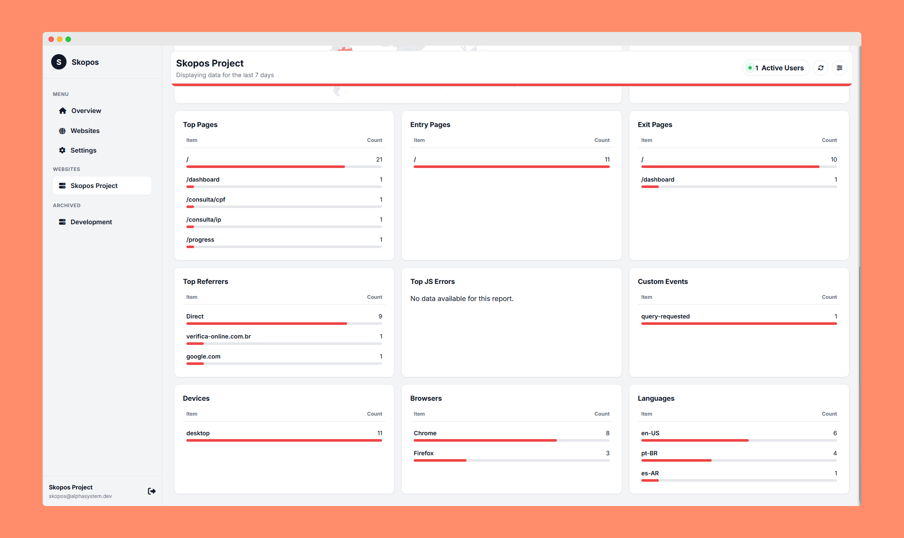

# Skopos Analytics - Dashboard

**Version 0.36.0**

This repository contains the source code for the Skopos Dashboard, the self-hosted web interface for the Skopos open-source, privacy-first analytics platform.

The dashboard provides a user-friendly interface to view aggregated and detailed analytics data, manage your websites, and configure tracking settings. It is a Node.js/Express application that uses EJS for server-side rendering and communicates with a PocketBase backend for all data storage and retrieval.

## Screenshots

Below are some screenshots showcasing different parts of the Skopos Dashboard:

<p align="center">
  
  <br>
  <em>Global Overview Dashboard</em>
</p>

<p align="center">
  
  <br>
  <em>Website Management Page</em>
</p>

<p align="center">
  
  <br>
  <em>Global Dashboard Settings</em>
</p>

<p align="center">
  
  <br>
  <em>Website Detailed Analytics</em>
</p>

<p align="center">
  
  <br>
  <em>Website Detailed Analytics</em>
</p>

<p align="center">
  
  <br>
  <em>Website-specific Settings</em>
</p>

<p align="center">
  
  <br>
  <em>Archived Website View</em>
</p>

## Features

-   **New User Registration**: The first time the application starts, it will guide you through creating the initial (and only) user account for the dashboard.
-   **Global Overview Dashboard**: A single view aggregating key metrics from all your websites.
-   **Per-Website Detailed Analytics**: Dive deep into the data for each of your sites.
-   **Live Active User Count**: See how many users are on your site in real-time.
-   **Instant Real-time Updates**: Utilize Server-Sent Events (SSE) for immediate dashboard refreshes when new data is collected, providing an "Instant" refresh rate option.
-   **Collapsible Sidebar**: Maximize your workspace with a collapsible sidebar that remembers your preference across sessions.
-   **Interactive Report Drawers**: Click on any report card to explore the full, searchable, and sortable dataset.
-   **JavaScript Error Analysis**: View detailed stack traces for frontend errors.
-   **Custom Event Data Inspector**: Analyze the custom JSON data sent with your events.
-   **Comprehensive SEO Analytics**: Automated SEO analysis with actionable recommendations, performance scoring, and technical health monitoring.
-   **SEO Dashboard Integration**: Real-time SEO score and critical metrics displayed directly on your main dashboard.
-   **On-Demand SEO Monitoring**: Automatic baseline analysis when a site is added, plus manual re-scans right from the dashboard whenever you need fresh data.
-   **State-Level Geo Insights**: Drill into a country's visitors to see top states and provinces directly from the dashboard reports.
-   **Secure API Key Vault**: Store third-party API keys per user with AES-256 encryption and fine-grained usage tracking.
-   **Privacy-First IP Management**: Optional raw IP address storage with GDPR-compliant defaults (hashed IDs only).
-   **Short Session Filtering**: Automatically discard sessions under 1 second to reduce noise and improve data quality.
-   **Chapybara IP Intelligence**: Advanced IP analysis with threat detection, proxy/VPN identification, and geolocation enrichment (requires API key).
-   **SDK Version Tracking**: Monitor connected SDK versions for each website directly from the dashboard.
-   **Enhanced Session Analytics**: Detailed session information including optional IP address display and click-to-copy functionality.
-   **Encrypted API Key Vault**: Securely store and manage third-party API keys with AES-256-GCM encryption, per-user isolation, and usage analytics.
-   **Email Notifications**: Receive real-time email alerts for important events using Resend integration with customizable notification rules.
-   **Optimized Uptime Monitoring**: Enhanced uptime monitoring with configurable retention periods, reducing database load while maintaining historical data accuracy.
-   **Configurable Data Retention**: Set global retention policies via environment variables to automatically manage database size and comply with data privacy regulations.
-   **Website Management**: Easily add, remove, restore, and archive your tracked websites; adding a new website keeps you on the management page.
-   **Configurable Settings**: Customize the dashboard experience, including theme, data period, refresh rates, privacy settings, and notification preferences.
-   **Toast Notifications**: Configurable toast notifications provide immediate feedback when settings are updated, with the ability to enable/disable in settings.
-   **Light & Dark Mode**: Automatic theme detection and manual toggle for your preference.
-   **Interactive Modals**: Custom confirmation dialogs and loading indicators for user actions.
-   **Responsive Design**: Optimized for desktop, tablet, and mobile devices with smart sidebar behavior.

## Tech Stack

-   **Backend**: Node.js, Express.js
-   **Frontend**: EJS (Embedded JavaScript templates) for server-side rendering, vanilla JavaScript for interactivity.
-   **Database**: [PocketBase](https://pocketbase.io/) (communicates via the PocketBase JS SDK).
-   **Charts & Maps**: [ApexCharts](https://apexcharts.com/) and [jsvectormap](https://github.com/themustafaomar/jsvectormap).
-   **Real-time**: Server-Sent Events (SSE) with Node's `eventsource` module.
-   **Scheduling**: `node-cron` for background data processing jobs.
-   **Logging**: Winston with daily log rotation for production-ready logging.
-   **Utilities**: `date-fns` for robust date manipulation.

## Getting Started

### Prerequisites

1.  **Node.js**: Version 18.x or higher.
2.  **npm**: Should be included with your Node.js installation.
3.  **A running PocketBase instance**: The dashboard requires a live PocketBase server to connect to. You must configure your PocketBase instance and import the required database collections from the `pb_schema.json` file included in this repository.

### Installation & Setup

1.  **Clone the repository:**
    ```bash
    git clone https://github.com/devAlphaSystem/Alpha-System-Skopos.git
    cd skopos-dashboard
    ```

2.  **Install dependencies:**
    ```bash
    npm install
    ```

3.  **Configure PocketBase:**
    Before proceeding, you must set up your PocketBase instance with the required database schema.
    
    a. Start your PocketBase instance if it's not already running
    
    b. Access the PocketBase Admin UI (typically at `http://localhost:8090/_/`)
    
    c. Navigate to **Settings** → **Import collections**
    
    d. Import the `pb_schema.json` file located in the root of this repository
    
    This will create all the necessary collections and their schemas for Skopos to function properly.

4.  **Create an environment file:**
    Copy the example environment file to create your own local configuration.
    ```bash
    cp .env.example .env
    ```

5.  **Configure environment variables:**
    Open the newly created `.env` file and fill in the values specific to your setup.

    ```ini
    # The port the dashboard application will run on
    PORT=3000

    # The environment the application is running in
    NODE_ENV="development"

    # The log level for the application
    LOG_LEVEL="info"

    # The internal URL to your PocketBase instance (accessible from the dashboard server)
    POCKETBASE_URL="http://127.0.0.1:8090"

    # Credentials for a PocketBase admin or superuser account
    POCKETBASE_ADMIN_EMAIL="admin@example.com"
    POCKETBASE_ADMIN_PASSWORD="your_admin_password"

    # Master encryption key for securing user API keys (NEVER commit this to version control!)
    ENCRYPTION_KEY="your_master_encryption_key_here"

    # Global data retention period in days (default: 180)
    # Records older than this will be permanently deleted during daily maintenance
    DATA_RETENTION_DAYS=180
    ```

### Running the Application

-   **For development:**
    This command uses `nodemon` to automatically restart the server when you make changes to the code.
    ```bash
    npm run dev
    ```

-   **For production:**
    This command starts the server using Node.
    ```bash
    node server.js
    ```

After starting the server, you can access the dashboard by navigating to `http://localhost:3000` (or whatever port you specified) in your browser.

### First-Time Setup

On your first visit, you'll be prompted to create an admin account. This is a one-time setup process:

1. Navigate to the dashboard URL
2. Fill in the registration form with your desired credentials
3. Submit to create your account and automatically log in

**Important:** Only one user account is supported per installation. This is intentional for self-hosted, single-tenant deployments.

## Key Features Explained

### Real-Time Updates

The dashboard uses Server-Sent Events (SSE) to provide real-time updates without polling:

- **Instant Refresh**: Set refresh rate to "Instant" for live data updates
- **Active Users**: See who's on your site right now (last 5 minutes)
- **Configuration Sync**: Dashboard settings sync to the SDK in real-time via WebSocket

### Interactive Reports

Click any report card to open a detailed drawer with:
- Full, searchable data
- Sortable columns
- Percentage breakdowns
- Drill-down capabilities (for errors, custom events, and geo breakdowns)

### Session Analytics

Track individual user journeys:
- View all sessions for each visitor
- See page flow and event timeline
- Identify users with the SDK's `identify()` method
- Delete individual sessions or all sessions for a visitor
- **Confirmation Dialogs**: Safety prompts before deleting session data
- **Loading Indicators**: Visual feedback during deletion operations
- **Accurate Metric Updates**: Automatically recalculates dashboard metrics after deletions

### JavaScript Error Tracking

Monitor frontend errors in production:
- Automatic error capture from the client-side script
- Full stack traces for debugging
- Deduplication by error signature
- Sort by frequency to prioritize fixes

### Custom Events

Track business-specific actions:
- View event frequencies
- Inspect custom data payloads (JSON)
- Filter by event name
- Export for further analysis

### SEO Analytics

Comprehensive search engine optimization analysis with intelligent recommendations:

#### Automated Analysis
- **Background Analysis on Creation**: New websites are automatically analyzed upon creation
- **On-Demand Analysis**: Manually trigger SEO scans anytime from the SEO Analytics page
- **Strategy Selection**: Choose between Mobile or Desktop analysis for PageSpeed Insights
  - Mobile strategy simulates slower networks and mobile devices (default)
  - Desktop strategy optimizes for faster networks and desktop browsers
  - Strategy is displayed with results for clarity
- **Credential Management**: Securely store API keys inside the dashboard (with environment variable fallback) to unlock performance scoring.

#### SEO Dashboard Integration
- **Real-time SEO Score**: 0-100 score displayed on the main dashboard with visual gauge
- **Critical Issues Counter**: Immediate visibility of high-priority problems
- **Quick Stats**: HTTPS status, sitemap availability, mobile responsiveness at a glance
- **Performance Metrics**: Lighthouse performance scores integrated into dashboard view

#### Detailed SEO Reports
- **Priority-based Recommendations**: Critical, high, medium, and low priority issues with actionable guidance
- **Meta Tag Analysis**: Title, description, canonical, and Open Graph validation
- **Technical SEO Checks**: SSL, sitemap, robots.txt, structured data, and compression
- **Content Analysis**: Heading structure, image optimization, and link quality
- **Performance Scoring**: Lighthouse-powered performance, accessibility, and best practices metrics
- **Link Health**: Broken link detection for internal links (up to 20 links checked per scan)
- **Image Optimization**: Alt text quality, oversized images, and title attribute monitoring

#### Smart Recommendations Engine
The system generates context-aware recommendations including:
- Missing or poorly optimized meta tags
- Security issues (missing HTTPS/SSL)
- Mobile responsiveness problems
- Heading structure issues (missing H1, multiple H1s)
- Image accessibility problems (missing/poor alt text, oversized images)
- Link quality issues (broken links, empty anchors, suspicious links)
- Performance bottlenecks (no compression, poor caching)
- Missing technical elements (sitemap, robots.txt, structured data)

### User Identification

Link anonymous visitors to known users:
- Track cross-device journeys
- Segment by user properties
- Connect to your CRM data
- View complete user history

### Chapybara IP Intelligence

Advanced IP address analysis powered by Chapybara's comprehensive IP intelligence database:

#### What You Get
- **Geolocation Data**: Detailed location information including continent, country, region, city, and coordinates
- **Network Information**: ASN, ISP, organization, and network type identification
- **Security Analysis**: 
  - Threat level assessment (none, low, medium, high)
  - Proxy/VPN detection with proxy type identification
  - Tor exit node detection
  - Datacenter IP identification
  - Spam/abuse source detection
- **Additional Insights**:
  - Reverse DNS hostnames
  - Mobile network detection and carrier identification
  - Time zone information
  - Ad targeting categories

#### How to Use
1. **Get an API Key**: Sign up at [Chapybara](https://chapyapi.com) and obtain your API key
2. **Add to Dashboard**: Go to Settings → API Keys and add your Chapybara key
3. **View Intelligence**: On any session details page with a stored IP address, click the "IP Intelligence" tab
4. **Analyze Threats**: Review security indicators to identify suspicious traffic

#### Use Cases
- **Fraud Prevention**: Identify proxy/VPN usage and datacenter IPs for payment fraud detection
- **Security Monitoring**: Detect Tor users and known threat sources
- **Geo-Targeting**: Verify user locations for content personalization and compliance
- **Traffic Analysis**: Understand your audience's network characteristics
- **Spam Detection**: Filter out known spam sources and abusive IPs

**Requirements**: 
- IP storage must be enabled (Settings → Privacy & Data Collection)
- Chapybara API key must be configured
- Available only for sessions with stored IP addresses

## Configuration

### Dashboard Settings

Accessible via the Settings button in the sidebar:

#### Appearance
- **Theme**: Light or Dark mode
- **Auto-detect**: Uses system preference
- **Collapsible Sidebar**: Toggle the sidebar width to maximize workspace
  - Click the collapse button in the sidebar header to toggle
  - Preference is saved across sessions in browser localStorage
  - On mobile devices, sidebar always displays at full width when open

#### Dashboard Updates
- **Auto-refresh**: Enable/disable automatic updates
- **Refresh Interval**: 30s, 1m, 2m, 5m, or Instant (SSE)
- **Refresh on focus**: Update when returning to the tab

#### Data Display
- **Time Frame**: Last 7, 14, 30, 90 days, or all time
- **Results Limit**: Items per report card (5-50)

#### API Keys
- **Google PageSpeed Insights**: Add or rotate API keys directly from the Settings → API Keys tab for richer SEO performance data.
- **Chapybara IP Intelligence**: Add your Chapybara API key to unlock advanced IP analysis with threat detection and geolocation data.
- **Resend Email Service**: Configure Resend API key and sender email to enable notification features.
- **Per-User Storage**: Keys are stored on a per-user basis and are never exposed to other accounts.
- **AES-256-GCM Encryption**: All keys are encrypted at rest using AES-256-GCM with authentication tags for maximum security. Requires an `ENCRYPTION_KEY` environment variable (64-character hex string).
- **Usage Tracking**: Monitor when keys were last used and how many times they've been called.
- **Secure Rotation**: Easily rotate or deactivate keys without affecting other users.
- **Environment Fallback**: If no dashboard key is present, the application falls back to the `PAGESPEED_API_KEY` environment variable when available.
- **Service-Specific Metadata**: Store additional configuration like sender email addresses for email services.

### Website Settings

Per-website configuration (click the settings icon on a website card):

#### Security
- **Domain**: Primary domain for security validation
- **IP Blacklist**: Exclude specific IP addresses
- **Localhost Tracking**: Enable/disable local development tracking

#### Data Management
- **Data Retention**: Automatic cleanup after 30, 60, 90, 365 days, or never (subject to global retention limits)
- **Global Retention Policy**: Administrators can configure a system-wide maximum retention period via `DATA_RETENTION_DAYS` environment variable
- **Archive**: Temporarily disable tracking while preserving data
- **Delete**: Permanently remove website and optionally all data

#### Privacy & Data Quality
- **Short Session Filtering**: Enable automatic filtering of sessions under 1 second to reduce noise from bots and accidental page loads
- **Session Quality Control**: Improves data quality by excluding ultra-short sessions that don't represent genuine user engagement

#### Email Notifications

Stay informed about important events on your websites with real-time email notifications powered by Resend.

**Prerequisites:**
1. Sign up for a free Resend account at [resend.com](https://resend.com)
2. Verify your domain or use Resend's test domain
3. Generate an API key from your Resend dashboard
4. Add the API key in Settings → API Keys → Resend Email Service
5. Provide a verified "from" email address (e.g., `notifications@yourdomain.com`)

**Notification Rules:**
Configure custom notification rules to receive emails when specific events occur:

- **New Visitor**: Get notified when a first-time visitor arrives
  - Includes location, device, browser, entry page, and referrer
- **New Session**: Alert when any session starts
  - Shows device, browser, OS, and location details
- **Custom Event**: Trigger on specific custom events you're tracking
  - Must specify the exact event name to monitor
  - Includes event data payloads in the notification
- **Daily Summary**: Receive daily analytics reports
  - Page views, unique visitors, new visitors, and sessions
- **Error Threshold**: Alert when errors exceed a threshold
  - Error counts and most common error details

**Rule Configuration:**
- **Rule Name**: Descriptive name for the notification (e.g., "New Visitor Alert")
- **Event Type**: Choose from the available event types
- **Recipient Email**: Email address to receive notifications (supports multiple rules to different recipients)
- **Website Filter**: Apply to all websites or a specific one
- **Active/Inactive**: Toggle rules on/off without deleting them

**Features:**
- Beautiful HTML email templates with color-coded priorities
- Automatic trigger tracking (see how many times each rule has fired)
- Last triggered timestamp for monitoring
- Toggle rules on/off without losing configuration
- Delete rules you no longer need
- Per-user isolation (rules are private to your account)
- Real-time event detection via PocketBase subscriptions

**Email Template Details:**
All notification emails include:
- Event-specific styling and icons
- Formatted data tables for easy reading
- Timestamps in your local format
- Structured information for quick scanning
- Brand-consistent design matching the dashboard theme

**Notifications Tab:**
The Notifications settings tab appears automatically when you have configured a Resend API key. If you remove your Resend key, the tab is hidden but your notification rules are preserved.

## Environment Variables

| Variable | Description | Example |
|----------|-------------|---------|
| `PORT` | Dashboard application port | `3000` |
| `NODE_ENV` | Application environment (development, production) | `development` |
| `LOG_LEVEL` | Logging verbosity level (error, warn, info, http, verbose, debug, silly) | `info` |
| `POCKETBASE_URL` | Internal PocketBase URL | `http://127.0.0.1:8090` |
| `POCKETBASE_ADMIN_EMAIL` | Admin account email | `admin@example.com` |
| `POCKETBASE_ADMIN_PASSWORD` | Admin account password | `your_secure_password` |
| `ENCRYPTION_KEY` | 64-character hex string (32 bytes) used to encrypt stored API keys with AES-256-GCM | `d4f1e2a3b4c5...` (64 chars) |
| `DATA_RETENTION_DAYS` | Global data retention period in days (default: 180). Records older than this are permanently deleted. | `180` |
| `PAGESPEED_API_KEY` | Optional fallback Google PageSpeed Insights API key (used if no dashboard key is configured) | `AIza...` |
| `PAGESPEED_STRATEGIES` | Optional comma-separated list of strategies for automated SEO scans (manual scans always prompt for selection) | `mobile,desktop` or `mobile` |

**Security Notes:**
- Use strong passwords for admin accounts
- In production, use HTTPS for both dashboard and PocketBase URLs
- Consider using a secrets manager for sensitive values
- Generate a secure `ENCRYPTION_KEY` with `node -e "console.log(require('crypto').randomBytes(32).toString('hex'))"`
- Never commit `.env` file to version control
- Rotating the `ENCRYPTION_KEY` will invalidate all stored API keys (they will need to be re-entered)

## API Endpoints

The dashboard exposes several API endpoints for the SDK and client script:

### Public Endpoints

- `POST /api/event` - Receives tracking events from the client-side script
- `GET /api/health` - Health check endpoint

### Protected Endpoints (require authentication)

- `GET /` - Global overview dashboard
- `GET /dashboard/:websiteId` - Website-specific dashboard
- `GET /sessions/:websiteId` - Sessions list
- `GET /sessions/:websiteId/:sessionId` - Session details
- `GET /websites` - Website management
- `GET /seo/:websiteId` - SEO analytics
- `GET /settings` - User settings
- `GET /api/dashboard-sse` - Server-Sent Events stream

## Development

### Running in Development Mode

```bash
npm run dev
```

Uses `nodemon` to automatically restart on file changes. Debug logging is enabled by default.

### Code Style

- **Backend**: ES modules (import/export)
- **Frontend**: Vanilla JavaScript (no framework)
  - Modular page-specific scripts in `public/js/pages/`
  - Shared utilities in `public/js/main.js`
  - Each page loads only its required JavaScript
  - Global utility functions: `customConfirm()`, `customAlert()`, `customAction()`, `showLoadingModal()`, `hideLoadingModal()`
- **Templates**: EJS with partials for reusability
- **Styling**: Custom CSS with CSS variables for theming

### Making Changes

1. **Backend changes**: Edit files in `src/`
2. **Frontend changes**: 
   - Edit page-specific logic in `public/js/pages/`
   - Edit shared utilities in `public/js/main.js`
3. **Styling**: Edit `public/css/style.css`
4. **Routes**: Add/modify routes in `src/routes/`
5. **Controllers**: Add/modify logic in `src/controllers/`

### Adding a New Page

1. Create EJS template in `views/`
2. Add route in `src/routes/`
3. Create controller in `src/controllers/`
4. (Optional) Create page-specific JavaScript in `public/js/pages/`
5. Add navigation link in `views/partials/header.ejs`

**Page JavaScript Architecture:**
- Each page can have its own JavaScript module in `public/js/pages/`
- Modules are loaded via the footer partial only for the pages that need them
- Shared functions go in `public/js/main.js`
- This keeps page load times fast and code organized

### Automated Background Processes

Skopos runs several automated cron jobs to maintain data quality and provide continuous monitoring:

#### Daily Jobs (Midnight UTC)
- **Data Aggregation** (00:00 UTC): Calculates daily dashboard summaries from raw events
- **Session Pruning** (00:00 UTC): Removes old session data based on retention policies

#### Cleanup Jobs
- **Orphaned Records Cleanup** (02:30 UTC): Removes analytics data for deleted websites

#### SEO Analysis Triggers
- **Background Baseline**: Automatically runs once when you add a new website.
- **Manual Re-Scans**: Launch on-demand analyses from the SEO Analytics page whenever you need updated insights.

All cron jobs run automatically when the dashboard application starts. No additional configuration is required.

## Deployment

### Prerequisites

- Node.js 18.x or higher
- PocketBase instance (running and accessible)
- Reverse proxy (nginx/Apache) for production HTTPS

### Production Deployment Steps

1. **Clone and install:**
   ```bash
   git clone https://github.com/devAlphaSystem/Alpha-System-Skopos.git
   cd Alpha_Skopos_Web
   npm install --production
   ```

2. **Configure environment:**
   ```bash
   cp .env.example .env
   nano .env  # Edit with your production values
   ```

3. **Start with a process manager:**
   ```bash
   # Using PM2
   npm install -g pm2
   pm2 start server.js --name skopos-dashboard
   pm2 save
   pm2 startup
   ```

4. **Configure reverse proxy (nginx example):**
   ```nginx
   server {
       listen 80;
       server_name analytics.yourdomain.com;

       location / {
           proxy_pass http://localhost:3000;
           proxy_http_version 1.1;
           proxy_set_header Upgrade $http_upgrade;
           proxy_set_header Connection 'upgrade';
           proxy_set_header Host $host;
           proxy_cache_bypass $http_upgrade;
           proxy_set_header X-Forwarded-For $proxy_add_x_forwarded_for;
           proxy_set_header X-Forwarded-Proto $scheme;
       }

       # SSE support
       location /api/dashboard-sse {
           proxy_pass http://localhost:3000;
           proxy_set_header Connection '';
           proxy_http_version 1.1;
           chunked_transfer_encoding off;
           proxy_buffering off;
           proxy_cache off;
       }
   }
   ```

5. **Set up SSL with Let's Encrypt:**
   ```bash
   sudo certbot --nginx -d analytics.yourdomain.com
   ```

## Troubleshooting

### Dashboard Won't Start

- **Check PocketBase**: Ensure PocketBase is running and accessible
- **Verify credentials**: Check admin email/password in `.env`
- **Port conflict**: Ensure PORT is not already in use
- **Dependencies**: Run `npm install` to ensure all packages are installed

### Can't Log In

- **First time**: Use the registration page instead of login
- **Forgotten password**: Access PocketBase admin UI to reset
- **Multiple users**: Only one account is supported; check PocketBase for existing users

### Data Not Appearing

- **SDK not initialized**: Verify the Skopos SDK is running on your website server
- **Wrong siteId**: Check tracking ID matches between SDK and dashboard
- **Domain mismatch**: Verify website domain is correctly configured
- **Firewall**: Ensure dashboard can communicate with PocketBase

### Real-Time Updates Not Working

- **SSE not supported**: Check browser compatibility (all modern browsers support SSE)
- **Proxy configuration**: Ensure your reverse proxy allows SSE connections
- **Network issues**: Check for firewalls blocking EventSource connections

### Performance Issues

- **High traffic**: Enable SDK event batching to reduce database load
- **Large datasets**: Implement data retention policies
- **Slow queries**: Ensure PocketBase indexes are properly configured
- **Memory leaks**: Restart the application and check for error logs

### Session Deletion Issues

If you encounter problems when deleting sessions:

- **Check server logs**: Enable debug mode to see detailed deletion processing
- **Invalid timestamps**: The system automatically handles events with invalid timestamps by using session creation date as fallback
- **Metric accuracy**: Dashboard summaries are automatically updated to reflect deleted data
- **Orphaned data**: The cleanup cron job (02:30 UTC) handles any orphaned records

### SEO Analysis Not Running

- **API Key Missing**: Add a Google PageSpeed key via Settings → API Keys or set the `PAGESPEED_API_KEY` environment variable for performance scoring.
- **Network Issues**: Ensure the server can reach external websites and Google's PageSpeed API.
- **Manual Analysis**: Click "Run SEO Analysis" on the SEO Analytics page to trigger an on-demand scan.

### IP Intelligence Not Loading

- **No API Key**: Add your Chapybara API key via Settings → API Keys
- **IP Storage Disabled**: Enable "Store Raw IP Addresses" in Settings → Privacy & Data Collection
- **No IP Address**: Session must have a stored IP address (only available when IP storage is enabled)
- **API Quota Exceeded**: Check your Chapybara account for daily quota limits
- **Rate Limiting**: Wait a moment and retry if you see a rate limit error
- **Invalid API Key**: Verify your Chapybara API key is correct and active

## Documentation

For detailed documentation:

- **[Client-Side Script Guide](https://docs.alphasystem.dev/view/cfbuhl4n4j4h0xj)**: Complete guide to the `skopos.js` tracking script
- **[Dashboard Guide](https://docs.alphasystem.dev/view/kgq24zxepony7w2)**: How to use the dashboard interface
- **[SDK Documentation](https://docs.alphasystem.dev/view/xfdb25r821hx04d)**: Server-side SDK API reference and usage

## Contributing

Contributions are welcome! Please:

1. Fork the repository
2. Create a feature branch (`git checkout -b feature/amazing-feature`)
3. Commit your changes (`git commit -m 'Add amazing feature'`)
4. Push to the branch (`git push origin feature/amazing-feature`)
5. Open a Pull Request

## License

This project is licensed under the MIT License - see the LICENSE file for details.

## Acknowledgments

Built with:
- [PocketBase](https://pocketbase.io/) - Backend and database
- [Express.js](https://expressjs.com/) - Web framework
- [ApexCharts](https://apexcharts.com/) - Charts and visualizations
- [jsvectormap](https://github.com/themustafaomar/jsvectormap) - Interactive maps
- [date-fns](https://date-fns.org/) - Date manipulation

## Privacy & Security

Skopos is designed with privacy as a core principle:

- ✅ **No cookies** - Fully cookie-free tracking
- ✅ **No external requests** - All data stays on your server
- ✅ **Visitor anonymization** - IPs are hashed by default, raw storage is optional
- ✅ **GDPR compliant** - No PII collected by default, opt-in IP storage
- ✅ **Flexible privacy controls** - Choose between complete anonymization or IP tracking based on your needs
- ✅ **Self-hosted** - You own and control all data
- ✅ **Open source** - Fully auditable code

### IP Address Storage Options

By default, Skopos prioritizes privacy:
- **Disabled (Default)**: Only hashed visitor IDs are stored, no raw IP addresses
- **Enabled (Optional)**: Store full IP addresses for debugging, security analysis, or compliance requirements
- **Per-Website Control**: Configure IP storage globally or per website
- **Easy Toggle**: Enable/disable in Settings → Privacy & Data Collection

**When to enable IP storage:**
- Security monitoring and threat detection
- Fraud prevention and abuse detection
- Legal compliance requirements
- Detailed user support and debugging

**Privacy considerations:**
- IP addresses are personal data under GDPR
- Ensure your privacy policy discloses IP collection if enabled
- Consider data retention policies for stored IPs
- Enable only if you have a legitimate business need