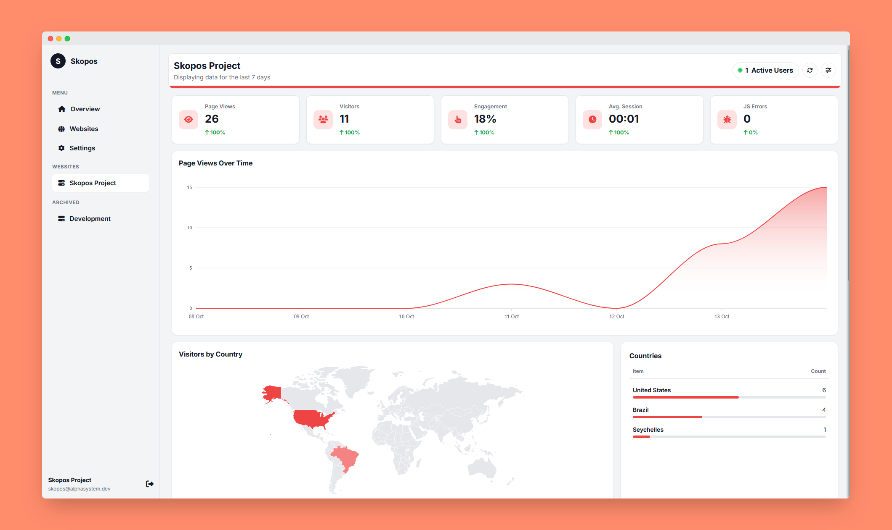

# Skopos Analytics - Dashboard

This repository contains the source code for the Skopos Dashboard, the self-hosted web interface for the Skopos open-source, privacy-first analytics platform.

The dashboard provides a user-friendly interface to view aggregated and detailed analytics data, manage your websites, and configure tracking settings. It is a Node.js/Express application that uses EJS for server-side rendering and communicates with a PocketBase backend for all data storage and retrieval.

## Screenshots

Below are some screenshots showcasing different parts of the Skopos Dashboard:

<p align="center">
  
  <br>
  <em>Global Overview Dashboard</em>
</p>

<p align="center">
  
  <br>
  <em>Website Management Page</em>
</p>

<p align="center">
  
  <br>
  <em>Global Dashboard Settings</em>
</p>

<p align="center">
  
  <br>
  <em>Website Detailed Analytics</em>
</p>

<p align="center">
  
  <br>
  <em>Website Detailed Analytics</em>
</p>

<p align="center">
  
  <br>
  <em>Website-specific Settings</em>
</p>

<p align="center">
  
  <br>
  <em>Archived Website View</em>
</p>

## Features

-   **New User Registration**: The first time the application starts, it will guide you through creating the initial (and only) user account for the dashboard.
-   **Global Overview Dashboard**: A single view aggregating key metrics from all your websites.
-   **Per-Website Detailed Analytics**: Dive deep into the data for each of your sites.
-   **Live Active User Count**: See how many users are on your site in real-time.
-   **Instant Real-time Updates**: Utilize Server-Sent Events (SSE) for immediate dashboard refreshes when new data is collected, providing an "Instant" refresh rate option.
-   **Interactive Report Drawers**: Click on any report card to explore the full, searchable, and sortable dataset.
-   **JavaScript Error Analysis**: View detailed stack traces for frontend errors.
-   **Custom Event Data Inspector**: Analyze the custom JSON data sent with your events.
-   **Comprehensive SEO Analytics**: Automated SEO analysis with actionable recommendations, performance scoring, and technical health monitoring.
-   **SEO Dashboard Integration**: Real-time SEO score and critical metrics displayed directly on your main dashboard.
-   **Automated SEO Monitoring**: Weekly automatic SEO scans for all active websites with background analysis on website creation.
-   **Privacy-First IP Management**: Optional raw IP address storage with GDPR-compliant defaults (hashed IDs only).
-   **SDK Version Tracking**: Monitor connected SDK versions for each website directly from the dashboard.
-   **Enhanced Session Analytics**: Detailed session information including optional IP address display and click-to-copy functionality.
-   **Website Management**: Easily add, remove, restore, and archive your tracked websites; adding a new website keeps you on the management page.
-   **Configurable Settings**: Customize the dashboard experience, including theme, data period, refresh rates, and privacy settings.
-   **Light & Dark Mode**: Automatic theme detection and manual toggle for your preference.

## Tech Stack

-   **Backend**: Node.js, Express.js
-   **Frontend**: EJS (Embedded JavaScript templates) for server-side rendering, vanilla JavaScript for interactivity.
-   **Database**: [PocketBase](https://pocketbase.io/) (communicates via the PocketBase JS SDK).
-   **Charts & Maps**: [ApexCharts](https://apexcharts.com/) and [jsvectormap](https://github.com/themustafaomar/jsvectormap).
-   **Real-time**: Server-Sent Events (SSE) with Node's `eventsource` module.
-   **Scheduling**: `node-cron` for background data processing jobs.
-   **Utilities**: `date-fns` for robust date manipulation.

## Getting Started

### Prerequisites

1.  **Node.js**: Version 18.x or higher.
2.  **npm**: Should be included with your Node.js installation.
3.  **A running PocketBase instance**: The dashboard requires a live PocketBase server to connect to. You must configure your PocketBase instance and import the required database collections from the `pb_schema.json` file included in this repository.

### Installation & Setup

1.  **Clone the repository:**
    ```bash
    git clone https://github.com/devAlphaSystem/Alpha-System-Skopos.git
    cd skopos-dashboard
    ```

2.  **Install dependencies:**
    ```bash
    npm install
    ```

3.  **Configure PocketBase:**
    Before proceeding, you must set up your PocketBase instance with the required database schema.
    
    a. Start your PocketBase instance if it's not already running
    
    b. Access the PocketBase Admin UI (typically at `http://localhost:8090/_/`)
    
    c. Navigate to **Settings** → **Import collections**
    
    d. Import the `pb_schema.json` file located in the root of this repository
    
    This will create all the necessary collections and their schemas for Skopos to function properly.

4.  **Create an environment file:**
    Copy the example environment file to create your own local configuration.
    ```bash
    cp .env.example .env
    ```

5.  **Configure environment variables:**
    Open the newly created `.env` file and fill in the values specific to your setup.

    ```ini
    # The port the dashboard application will run on
    PORT=3000

    # The internal URL to your PocketBase instance (accessible from the dashboard server)
    POCKETBASE_URL="http://127.0.0.1:8090"

    # Credentials for a PocketBase admin or superuser account
    POCKETBASE_ADMIN_EMAIL="admin@example.com"
    POCKETBASE_ADMIN_PASSWORD="your_admin_password"

    # Optional: Google PageSpeed Insights API key for enhanced performance analysis
    PAGESPEED_API_KEY="your-pagespeed-api-key"
    ```

### Running the Application

-   **For development:**
    This command uses `nodemon` to automatically restart the server when you make changes to the code.
    ```bash
    npm run dev
    ```

-   **For production:**
    This command starts the server using Node.
    ```bash
    node server.js
    ```

After starting the server, you can access the dashboard by navigating to `http://localhost:3000` (or whatever port you specified) in your browser.

### First-Time Setup

On your first visit, you'll be prompted to create an admin account. This is a one-time setup process:

1. Navigate to the dashboard URL
2. Fill in the registration form with your desired credentials
3. Submit to create your account and automatically log in

**Important:** Only one user account is supported per installation. This is intentional for self-hosted, single-tenant deployments.

## Project Structure

```
skopos-dashboard/
├── server.js                 # Main application entry point
├── nodemon.json             # Nodemon configuration for development
├── package.json             # Dependencies and scripts
├── pb_schema.json           # PocketBase schema definition
├── .env                     # Environment variables (create from .env.example)
├── client/                  # Client-side tracking scripts
│   ├── skopos.js           # Full client script
│   └── skopos-min.js       # Minified version
├── docs/                    # Comprehensive documentation
│   ├── client_side_script.md
│   ├── dashboard_guide.md
│   └── sdk_documentation.md
├── public/                  # Static assets
│   ├── css/                # Stylesheets
│   ├── img/                # Images and icons
│   └── js/                 # Client-side JavaScript
│       ├── dashboard.js    # Main dashboard logic
│       ├── main.js         # Common utilities
│       └── seo.js          # SEO analyzer
├── src/                     # Server-side source code
│   ├── controllers/        # Request handlers
│   ├── routes/             # Express route definitions
│   ├── services/           # Business logic
│   │   ├── seoAnalyzer.js # SEO analysis engine with recommendations
│   │   └── cron.js        # Scheduled jobs (SEO, cleanup, aggregation)
│   └── utils/              # Utility functions
└── views/                   # EJS templates
    ├── partials/           # Reusable template components
    └── *.ejs               # Page templates
```

## Key Features Explained

### Real-Time Updates

The dashboard uses Server-Sent Events (SSE) to provide real-time updates without polling:

- **Instant Refresh**: Set refresh rate to "Instant" for live data updates
- **Active Users**: See who's on your site right now (last 5 minutes)
- **Configuration Sync**: Dashboard settings sync to the SDK in real-time via WebSocket

### Interactive Reports

Click any report card to open a detailed drawer with:
- Full, searchable data
- Sortable columns
- Percentage breakdowns
- Drill-down capabilities (for errors and custom events)

### Session Analytics

Track individual user journeys:
- View all sessions for each visitor
- See page flow and event timeline
- Identify users with the SDK's `identify()` method
- Delete individual sessions or all sessions for a visitor

### JavaScript Error Tracking

Monitor frontend errors in production:
- Automatic error capture from the client-side script
- Full stack traces for debugging
- Deduplication by error signature
- Sort by frequency to prioritize fixes

### Custom Events

Track business-specific actions:
- View event frequencies
- Inspect custom data payloads (JSON)
- Filter by event name
- Export for further analysis

### SEO Analytics

Comprehensive search engine optimization analysis with intelligent recommendations:

#### Automated Analysis
- **Background Analysis on Creation**: New websites are automatically analyzed upon creation
- **Weekly Automated Scans**: Scheduled SEO analysis runs every Tuesday at 3:00 AM UTC for all active websites
- **On-Demand Analysis**: Manually trigger SEO scans anytime from the SEO Analytics page

#### SEO Dashboard Integration
- **Real-time SEO Score**: 0-100 score displayed on the main dashboard with visual gauge
- **Critical Issues Counter**: Immediate visibility of high-priority problems
- **Quick Stats**: HTTPS status, sitemap availability, mobile responsiveness at a glance
- **Performance Metrics**: Lighthouse performance scores integrated into dashboard view

#### Detailed SEO Reports
- **Priority-based Recommendations**: Critical, high, medium, and low priority issues with actionable guidance
- **Meta Tag Analysis**: Title, description, canonical, and Open Graph validation
- **Technical SEO Checks**: SSL, sitemap, robots.txt, structured data, and compression
- **Content Analysis**: Heading structure, image optimization, and link quality
- **Performance Scoring**: Lighthouse-powered performance, accessibility, and best practices metrics
- **Link Health**: Broken link detection for internal links (up to 20 links checked per scan)
- **Image Optimization**: Alt text quality, oversized images, and title attribute monitoring

#### Smart Recommendations Engine
The system generates context-aware recommendations including:
- Missing or poorly optimized meta tags
- Security issues (missing HTTPS/SSL)
- Mobile responsiveness problems
- Heading structure issues (missing H1, multiple H1s)
- Image accessibility problems (missing/poor alt text, oversized images)
- Link quality issues (broken links, empty anchors, suspicious links)
- Performance bottlenecks (no compression, poor caching)
- Missing technical elements (sitemap, robots.txt, structured data)

### User Identification

Link anonymous visitors to known users:
- Track cross-device journeys
- Segment by user properties
- Connect to your CRM data
- View complete user history

## Configuration

### Dashboard Settings

Accessible via the Settings button in the sidebar:

#### Appearance
- **Theme**: Light or Dark mode
- **Auto-detect**: Uses system preference

#### Dashboard Updates
- **Auto-refresh**: Enable/disable automatic updates
- **Refresh Interval**: 30s, 1m, 2m, 5m, or Instant (SSE)
- **Refresh on focus**: Update when returning to the tab

#### Data Display
- **Time Frame**: Last 7, 14, 30, 90 days, or all time
- **Results Limit**: Items per report card (5-50)

### Website Settings

Per-website configuration (click the settings icon on a website card):

#### Security
- **Domain**: Primary domain for security validation
- **IP Blacklist**: Exclude specific IP addresses
- **Localhost Tracking**: Enable/disable local development tracking

#### Data Management
- **Data Retention**: Automatic cleanup after 30, 60, 90, 365 days, or never
- **Archive**: Temporarily disable tracking while preserving data
- **Delete**: Permanently remove website and optionally all data

## Environment Variables

| Variable | Description | Example |
|----------|-------------|---------||
| `PORT` | Dashboard application port | `3000` |
| `POCKETBASE_URL` | Internal PocketBase URL | `http://127.0.0.1:8090` |
| `POCKETBASE_ADMIN_EMAIL` | Admin account email | `admin@example.com` |
| `POCKETBASE_ADMIN_PASSWORD` | Admin account password | `your_secure_password` |
| `PAGESPEED_API_KEY` | Google PageSpeed Insights API key (optional) | `your_api_key` |

**Security Notes:**
- Use strong passwords for admin accounts
- In production, use HTTPS for both dashboard and PocketBase URLs
- Consider using a secrets manager for sensitive values

## API Endpoints

The dashboard exposes several API endpoints for the SDK and client script:

### Public Endpoints

- `POST /api/event` - Receives tracking events from the client-side script
- `GET /api/health` - Health check endpoint

### Protected Endpoints (require authentication)

- `GET /` - Global overview dashboard
- `GET /dashboard/:websiteId` - Website-specific dashboard
- `GET /sessions/:websiteId` - Sessions list
- `GET /sessions/:websiteId/:sessionId` - Session details
- `GET /websites` - Website management
- `GET /seo/:websiteId` - SEO analytics
- `GET /settings` - User settings
- `GET /api/dashboard-sse` - Server-Sent Events stream

## Development

### Running in Development Mode

```bash
npm run dev
```

Uses `nodemon` to automatically restart on file changes. Debug logging is enabled by default.

### Code Style

- **Backend**: ES modules (import/export)
- **Frontend**: Vanilla JavaScript (no framework)
- **Templates**: EJS with partials for reusability
- **Styling**: Custom CSS with CSS variables for theming

### Making Changes

1. **Backend changes**: Edit files in `src/`
2. **Frontend changes**: Edit files in `public/js/` or `views/`
3. **Styling**: Edit `public/css/style.css`
4. **Routes**: Add/modify routes in `src/routes/`
5. **Controllers**: Add/modify logic in `src/controllers/`

### Adding a New Page

1. Create EJS template in `views/`
2. Add route in `src/routes/`
3. Create controller in `src/controllers/`
4. Add navigation link in `views/partials/header.ejs`

### Automated Background Processes

Skopos runs several automated cron jobs to maintain data quality and provide continuous monitoring:

#### Daily Jobs (Midnight UTC)
- **Data Aggregation** (00:00 UTC): Calculates daily dashboard summaries from raw events
- **Session Pruning** (00:00 UTC): Removes old session data based on retention policies

#### Cleanup Jobs
- **Orphaned Records Cleanup** (02:30 UTC): Removes analytics data for deleted websites

#### Weekly SEO Analysis (Tuesday 03:00 UTC)
- **Automated SEO Scans**: Analyzes all active (non-archived) websites
- **Updates SEO Scores**: Refreshes recommendations and performance metrics
- **2-second delay between sites**: Prevents API rate limiting
- **Logs results**: Success/failure tracking for monitoring

All cron jobs run automatically when the dashboard application starts. No additional configuration is required.

## Deployment

### Prerequisites

- Node.js 18.x or higher
- PocketBase instance (running and accessible)
- Reverse proxy (nginx/Apache) for production HTTPS

### Production Deployment Steps

1. **Clone and install:**
   ```bash
   git clone https://github.com/devAlphaSystem/Alpha-System-Skopos.git
   cd Alpha_Skopos_Web
   npm install --production
   ```

2. **Configure environment:**
   ```bash
   cp .env.example .env
   nano .env  # Edit with your production values
   ```

3. **Start with a process manager:**
   ```bash
   # Using PM2
   npm install -g pm2
   pm2 start server.js --name skopos-dashboard
   pm2 save
   pm2 startup
   ```

4. **Configure reverse proxy (nginx example):**
   ```nginx
   server {
       listen 80;
       server_name analytics.yourdomain.com;

       location / {
           proxy_pass http://localhost:3000;
           proxy_http_version 1.1;
           proxy_set_header Upgrade $http_upgrade;
           proxy_set_header Connection 'upgrade';
           proxy_set_header Host $host;
           proxy_cache_bypass $http_upgrade;
           proxy_set_header X-Forwarded-For $proxy_add_x_forwarded_for;
           proxy_set_header X-Forwarded-Proto $scheme;
       }

       # SSE support
       location /api/dashboard-sse {
           proxy_pass http://localhost:3000;
           proxy_set_header Connection '';
           proxy_http_version 1.1;
           chunked_transfer_encoding off;
           proxy_buffering off;
           proxy_cache off;
       }
   }
   ```

5. **Set up SSL with Let's Encrypt:**
   ```bash
   sudo certbot --nginx -d analytics.yourdomain.com
   ```

## Troubleshooting

### Dashboard Won't Start

- **Check PocketBase**: Ensure PocketBase is running and accessible
- **Verify credentials**: Check admin email/password in `.env`
- **Port conflict**: Ensure PORT is not already in use
- **Dependencies**: Run `npm install` to ensure all packages are installed

### Can't Log In

- **First time**: Use the registration page instead of login
- **Forgotten password**: Access PocketBase admin UI to reset
- **Multiple users**: Only one account is supported; check PocketBase for existing users

### Data Not Appearing

- **SDK not initialized**: Verify the Skopos SDK is running on your website server
- **Wrong siteId**: Check tracking ID matches between SDK and dashboard
- **Domain mismatch**: Verify website domain is correctly configured
- **Firewall**: Ensure dashboard can communicate with PocketBase

### Real-Time Updates Not Working

- **SSE not supported**: Check browser compatibility (all modern browsers support SSE)
- **Proxy configuration**: Ensure your reverse proxy allows SSE connections
- **Network issues**: Check for firewalls blocking EventSource connections

### Performance Issues

- **High traffic**: Enable SDK event batching to reduce database load
- **Large datasets**: Implement data retention policies
- **Slow queries**: Ensure PocketBase indexes are properly configured
- **Memory leaks**: Restart the application and check for error logs

### Session Deletion Issues

If you encounter problems when deleting sessions:

- **Check server logs**: Enable debug mode to see detailed deletion processing
- **Invalid timestamps**: The system automatically handles events with invalid timestamps by using session creation date as fallback
- **Metric accuracy**: Dashboard summaries are automatically updated to reflect deleted data
- **Orphaned data**: The cleanup cron job (02:30 UTC) handles any orphaned records

### SEO Analysis Not Running

- **API Key Missing**: Set `PAGESPEED_API_KEY` environment variable for performance scores (optional but recommended)
- **Network Issues**: Ensure the server can reach external websites and Google's PageSpeed API
- **Weekly Scans**: Verify cron jobs are running (check server logs on Tuesday mornings)
- **Manual Analysis**: Click "Run SEO Analysis" button on the SEO Analytics page to trigger on-demand scan

## Documentation

For detailed documentation:

- **[Client-Side Script Guide](https://docs.alphasystem.dev/view/cfbuhl4n4j4h0xj)**: Complete guide to the `skopos.js` tracking script
- **[Dashboard Guide](https://docs.alphasystem.dev/view/kgq24zxepony7w2)**: How to use the dashboard interface
- **[SDK Documentation](https://docs.alphasystem.dev/view/xfdb25r821hx04d)**: Server-side SDK API reference and usage

## Contributing

Contributions are welcome! Please:

1. Fork the repository
2. Create a feature branch (`git checkout -b feature/amazing-feature`)
3. Commit your changes (`git commit -m 'Add amazing feature'`)
4. Push to the branch (`git push origin feature/amazing-feature`)
5. Open a Pull Request

## License

This project is licensed under the MIT License - see the LICENSE file for details.

## Acknowledgments

Built with:
- [PocketBase](https://pocketbase.io/) - Backend and database
- [Express.js](https://expressjs.com/) - Web framework
- [ApexCharts](https://apexcharts.com/) - Charts and visualizations
- [jsvectormap](https://github.com/themustafaomar/jsvectormap) - Interactive maps
- [date-fns](https://date-fns.org/) - Date manipulation

## Privacy & Security

Skopos is designed with privacy as a core principle:

- ✅ **No cookies** - Fully cookie-free tracking
- ✅ **No external requests** - All data stays on your server
- ✅ **Visitor anonymization** - IPs are hashed by default, raw storage is optional
- ✅ **GDPR compliant** - No PII collected by default, opt-in IP storage
- ✅ **Flexible privacy controls** - Choose between complete anonymization or IP tracking based on your needs
- ✅ **Self-hosted** - You own and control all data
- ✅ **Open source** - Fully auditable code

### IP Address Storage Options

By default, Skopos prioritizes privacy:
- **Disabled (Default)**: Only hashed visitor IDs are stored, no raw IP addresses
- **Enabled (Optional)**: Store full IP addresses for debugging, security analysis, or compliance requirements
- **Per-Website Control**: Configure IP storage globally or per website
- **Easy Toggle**: Enable/disable in Settings → Privacy & Data Collection

**When to enable IP storage:**
- Security monitoring and threat detection
- Fraud prevention and abuse detection
- Legal compliance requirements
- Detailed user support and debugging

**Privacy considerations:**
- IP addresses are personal data under GDPR
- Ensure your privacy policy discloses IP collection if enabled
- Consider data retention policies for stored IPs
- Enable only if you have a legitimate business need