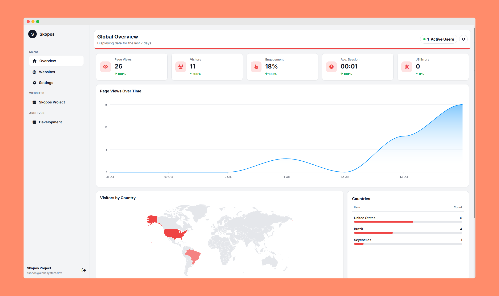

# Skopos Analytics - Dashboard

This repository contains the source code for the Skopos Dashboard, the self-hosted web interface for the Skopos open-source, privacy-first analytics platform.

The dashboard provides a user-friendly interface to view aggregated and detailed analytics data, manage your websites, and configure tracking settings. It is a Node.js/Express application that uses EJS for server-side rendering and communicates with a PocketBase backend for all data storage and retrieval.

## Screenshots

Below are some screenshots showcasing different parts of the Skopos Dashboard:

<p align="center">
  
  <br>
  <em>Global Overview Dashboard</em>
</p>

<p align="center">
  
  <br>
  <em>Website Management Page</em>
</p>

<p align="center">
  
  <br>
  <em>Global Dashboard Settings</em>
</p>

<p align="center">
  
  <br>
  <em>Website Detailed Analytics</em>
</p>

<p align="center">
  
  <br>
  <em>Website Detailed Analytics</em>
</p>

<p align="center">
  
  <br>
  <em>Website-specific Settings</em>
</p>

<p align="center">
  
  <br>
  <em>Archived Website View</em>
</p>

## Features

-   **New User Registration**: The first time the application starts, it will guide you through creating the initial (and only) user account for the dashboard.
-   **Global Overview Dashboard**: A single view aggregating key metrics from all your websites.
-   **Per-Website Detailed Analytics**: Dive deep into the data for each of your sites.
-   **Live Active User Count**: See how many users are on your site in real-time.
-   **Instant Real-time Updates**: Utilize Server-Sent Events (SSE) for immediate dashboard refreshes when new data is collected, providing an "Instant" refresh rate option.
-   **Interactive Report Drawers**: Click on any report card to explore the full, searchable, and sortable dataset.
-   **JavaScript Error Analysis**: View detailed stack traces for frontend errors.
-   **Custom Event Data Inspector**: Analyze the custom JSON data sent with your events.
-   **Website Management**: Easily add, remove, restore, and archive your tracked websites; adding a new website keeps you on the management page.
-   **Configurable Settings**: Customize the dashboard experience, including theme, data period, and refresh rates (now including "Instant").
-   **Light & Dark Mode**: Automatic theme detection and manual toggle for your preference.

## Tech Stack

-   **Backend**: Node.js, Express.js
-   **Frontend**: EJS (Embedded JavaScript templates) for server-side rendering, vanilla JavaScript for interactivity.
-   **Database**: [PocketBase](https://pocketbase.io/) (communicates via the PocketBase JS SDK).
-   **Charts & Maps**: [ApexCharts](https://apexcharts.com/) and [jsvectormap](https://github.com/themustafaomar/jsvectormap).
-   **Real-time**: Server-Sent Events (SSE) with Node's `eventsource` module.
-   **Scheduling**: `node-cron` for background data processing jobs.
-   **Utilities**: `date-fns` for robust date manipulation.

## Getting Started

### Prerequisites

1.  **Node.js**: Version 18.x or higher.
2.  **npm**: Should be included with your Node.js installation.
3.  **A running PocketBase instance**: The dashboard requires a live PocketBase server to connect to. Ensure you have followed the main Skopos setup instructions to deploy PocketBase and create the necessary collections.

### Installation & Setup

1.  **Clone the repository:**
    ```bash
    git clone https://github.com/devAlphaSystem/Alpha-System-Skopos.git
    cd skopos-dashboard
    ```

2.  **Install dependencies:**
    ```bash
    npm install
    ```

3.  **Create an environment file:**
    Copy the example environment file to create your own local configuration.
    ```bash
    cp .env.example .env
    ```

4.  **Configure environment variables:**
    Open the newly created `.env` file and fill in the values specific to your setup.

    ```ini
    # The port the dashboard application will run on
    PORT=3000

    # The internal URL to your PocketBase instance (accessible from the dashboard server)
    POCKETBASE_URL="http://127.0.0.1:8090"

    # The public-facing URL for your PocketBase instance. This may be the same as POCKETBASE_URL in local development.
    PUBLIC_POCKETBASE_URL="http://localhost:8090"

    # Credentials for a PocketBase admin or superuser account
    POCKETBASE_ADMIN_EMAIL="admin@example.com"
    POCKETBASE_ADMIN_PASSWORD="your_admin_password"

    # A secret string used for hashing visitor IDs. Make this a long, random string.
    SECRET_SALT="your-super-secret-random-string-for-hashing"
    ```

### Running the Application

-   **For development:**
    This command uses `nodemon` to automatically restart the server when you make changes to the code.
    ```bash
    npm run dev
    ```

-   **For production:**
    This command starts the server using Node.
    ```bash
    node server.js
    ```

After starting the server, you can access the dashboard by navigating to `http://localhost:3000` (or whatever port you specified) in your browser.