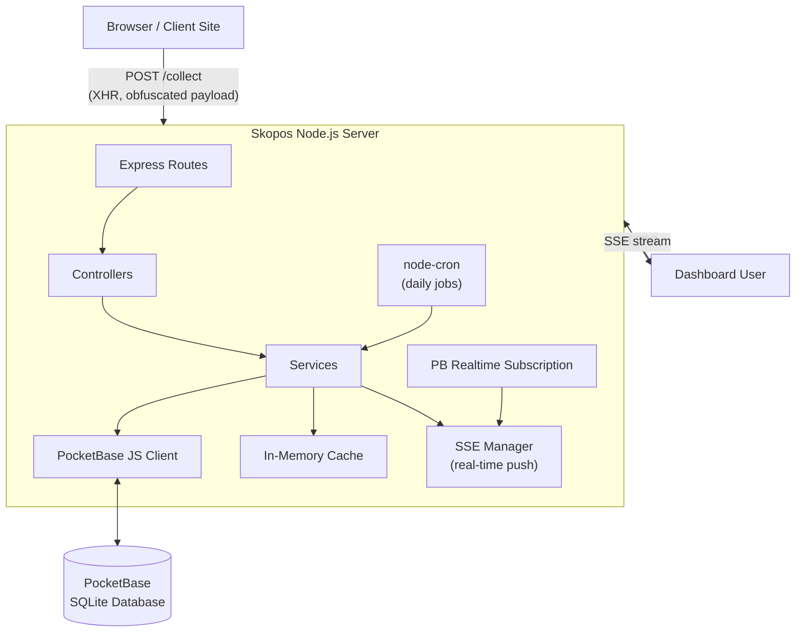
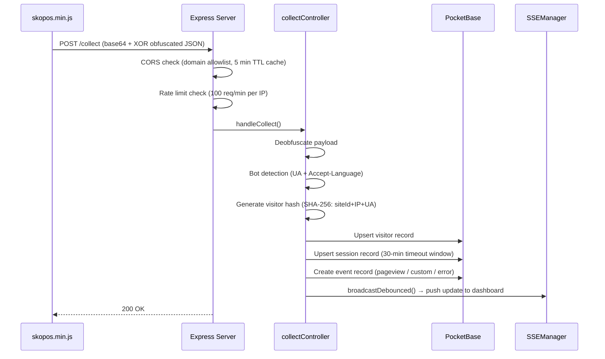
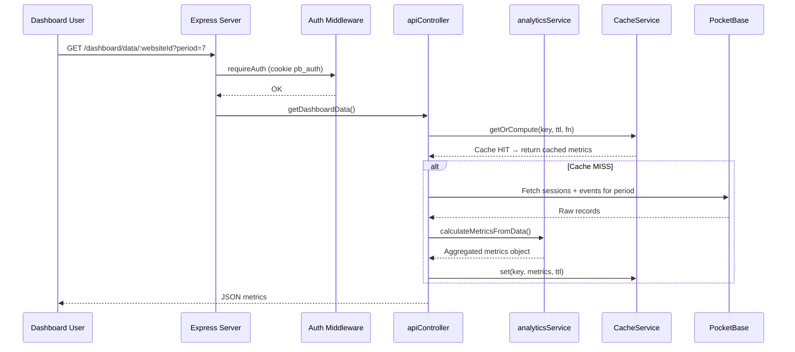
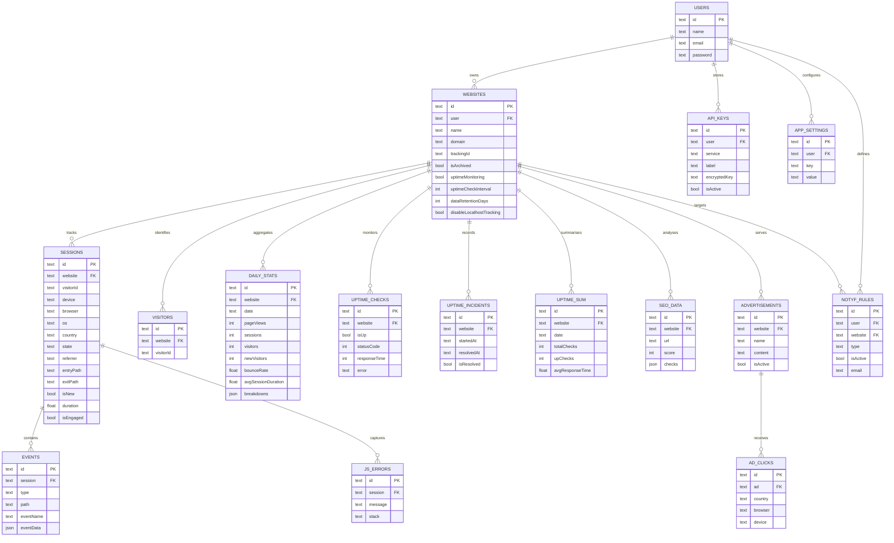

# Architecture Overview

## System Summary

Skopos Dashboard is a monolithic Node.js server application that provides:

1. A **web analytics collection endpoint** (`POST /collect`) that receives data from the `skopos.min.js` browser script.
2. A **dashboard web application** (server-rendered EJS + client-side JS) for visualising analytics, managing websites, monitoring uptime, analysing SEO, and running notification rules.
3. An **embedded or external PocketBase** instance that serves as the sole data store.

---

## High-Level Component Diagram



---

## Request Lifecycle

### Analytics Collection Request



### Dashboard Data Request



---

## Database Schema (ER Diagram)



---

## Component Responsibilities

### `server.js` — Application Entry Point

Orchestrates the full startup sequence:

1. Conditionally boots embedded PocketBase (`pb-embedded.js`).
2. Calls `initializeAppState()` to check whether the first user exists.
3. Configures Express middleware (compression, JSON, cookies, device detection).
4. Mounts all route modules.
5. Registers the global authentication middleware (reads `pb_auth` cookie, populates `res.locals.user`).
6. Starts cron jobs, realtime subscription, uptime monitoring, and daily rollup backfill.
7. Registers `SIGTERM`/`SIGINT` handlers for graceful shutdown.

### Routes (`src/routes/`)

Thin Express Router modules. Each file:
- Defines `requireAuth` (redirect to `/login` for HTML routes, `401` for API routes).
- Optionally defines `blockMobile` (returns `403` for the website management, SEO, uptime, and ads UIs — these are desktop-only).
- Maps HTTP methods + paths to controller functions.

### Controllers (`src/controllers/`)

Handle HTTP request/response. They:
- Parse and validate request inputs.
- Call one or more service functions.
- Render an EJS view or return JSON.
- Do not contain business logic.

| Controller | Responsibility |
|------------|---------------|
| `authController` | Login, registration, logout |
| `collectController` | Analytics data ingestion (POST /collect) |
| `apiController` | JSON data APIs for dashboard and SSE connections |
| `dashboardController` | Overview, per-website dashboard, and compare views |
| `websitesController` | Website CRUD, IP blacklist, data cleanup |
| `sessionsController` | Session explorer and visitor detail views |
| `uptimeController` | Uptime status, manual checks, incident management |
| `seoController` | SEO report display, analysis trigger, CSV export |
| `adsController` | Advertisement management, banner preview, embed code |
| `settingsController` | App settings, API key management, notification rules |

### Services (`src/services/`)

All business logic lives here. Services are stateless (except for in-memory caches).

| Service | Responsibility |
|---------|---------------|
| `pocketbase.js` | PocketBase client instances (`pb` for user requests, `pbAdmin` for server operations), admin auth management |
| `appState.js` | Tracks whether the first user account exists; gates `/register` vs. `/login` routing |
| `analyticsService.js` | Queries PocketBase for sessions + events, computes aggregated metrics (visitors, bounce rate, session duration, breakdowns) |
| `rollupService.js` | Reads and writes `daily_stats` (pre-aggregated daily summaries); falls back to raw computation for recent dates |
| `cacheService.js` | LRU-like in-memory cache with TTLs; used by analytics and website list queries |
| `sseManager.js` | Manages connected `text/event-stream` clients; debounces broadcasts per website |
| `realtime.js` | Subscribes to PocketBase realtime events; triggers SSE broadcasts and notification checks on new sessions/events |
| `uptimeMonitor.js` | Schedules per-website HTTP checks; manages IPv4 DNS fallback; records incidents; sends notifications |
| `uptimeSummary.js` | Reads/writes `uptime_sum` daily summaries |
| `cron.js` | Registers recurring jobs: data retention enforcement, raw data pruning, orphan cleanup, daily stats rollup, daily notification emails |
| `notificationService.js` | Renders and sends HTML emails via Resend; used for daily digests and uptime alerts |
| `notificationRuleUtils.js` | Resolves website targets for notification rules; builds email payload data |
| `appSettingsService.js` | Key/value store in `app_settings` collection; cached with 5-minute TTL |
| `apiKeyManager.js` | Stores API keys encrypted with AES-256-GCM; retrieves and decrypts on demand |
| `seoAnalyzer.js` | Fetches HTML, extracts meta tags, computes SEO score; optionally calls Google PageSpeed API and Chapybara screenshot |
| `adsService.js` | Records ad impressions and click events |
| `updateChecker.js` | Polls GitHub API for newer releases; shows update banner in dashboard |

### Utilities (`src/utils/`)

| Utility | Responsibility |
|---------|---------------|
| `logger.js` | Winston logger; writes JSON to daily rotating files + coloured console |
| `encryption.js` | AES-256-GCM encrypt/decrypt with PBKDF2 key derivation per-operation |
| `deviceDetection.js` | UA regex-based mobile detection; Express middleware populating `res.locals.isMobile` |
| `countries.js` | Country code → country name lookup map |

### `src/lib/pb-embedded.js` — PocketBase Lifecycle Manager

A self-contained module (also usable as a CLI) that:
- Downloads the correct PocketBase binary for the current platform.
- Provisions the superuser account.
- Spawns PocketBase as a child process.
- Waits for the health endpoint.
- Applies the `db_schema.json` collection schema.
- Exports `boot()`, `stop()`, `getClient()` and individual lifecycle functions.

---

## Data Flow: End-to-End Analytics

```
Browser
  └─ skopos.min.js batches events every 5 s (default)
       └─ POST /collect  {XOR-obfuscated + base64 payload}
            └─ collectController
                 ├─ CORS: domain allowlist (5-min cache from `websites`)
                 ├─ Rate limit: 100 req / 60 s per IP
                 ├─ Bot filter: UA pattern + missing Accept-Language
                 ├─ Visitor fingerprint: SHA-256(siteId + IP + UA) → 32-char hex
                 ├─ Session: 30-min inactivity window, stored in sessionCache (in-memory)
                 ├─ PocketBase writes: visitor (upsert) → session (upsert) → event (insert)
                 └─ broadcastDebounced() → SSE push to open dashboards (2 s debounce)

Dashboard
  └─ GET /dashboard/data/:id?period=7
       └─ apiController
            └─ cacheService.getOrCompute()
                 ├─ Cache HIT → return JSON immediately
                 └─ Cache MISS
                      ├─ analyticsService.fetchRecordsForPeriod() → PocketBase queries
                      └─ calculateMetricsFromData() → aggregated metrics object → cache → JSON
```

---

## Cron Job Schedule

| Job | Schedule | Description |
|-----|----------|-------------|
| Data retention enforcement | Daily 02:30 | Deletes sessions/events per per-website `dataRetentionDays` setting |
| Raw data pruning | Daily 03:00 | Deletes all data older than `DATA_RETENTION_DAYS` (global) |
| Orphan cleanup | Daily 03:30 | Removes visitor records with no associated sessions |
| Daily stats rollup | Daily 00:30 | Aggregates yesterday's raw data into `daily_stats` |
| Daily notification emails | Configurable | Sends daily digest emails to users with active rules |

---

## Authentication Model

- Single-user application. Only one user account is permitted.
- After first registration, `/register` is permanently disabled and redirects to `/login`.
- Authentication uses PocketBase's built-in cookie-based auth. The cookie `pb_auth` contains `{token, model}` as JSON.
- Every request parses this cookie and calls `pb.authStore.save(token, model)` to populate `res.locals.user` through the global auth middleware.
- Unauthenticated requests to protected routes are redirected to `/login` (HTML routes) or returned `401 JSON` (API routes).

---

## Real-Time Architecture

SSE (Server-Sent Events) enables live dashboard updates without polling:

1. The dashboard opens a persistent `GET /dashboard/events` connection.
2. The PocketBase realtime subscription (`realtime.js`) detects new sessions and events.
3. On new data, `broadcastDebounced(websiteId)` is called with a 2-second debounce per website.
4. `sseManager.js` writes `data: {...}\n\n` to all connected clients.
5. The browser-side JavaScript refreshes the displayed metrics.

The system supports up to 100 simultaneous SSE clients. Heartbeat messages are sent every 30 seconds to keep connections alive through proxies.
